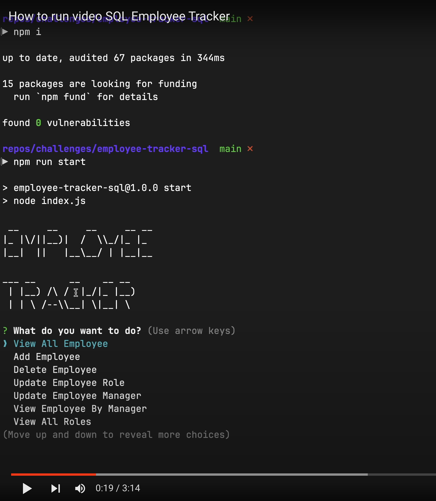

# Employee-Tracker-SQL

[GitHub Repo Link](https://github.com/salidamaharjan/employee-tracker-sql)

## Description
* This project is build to track the employee in table.
* MySQL2, Inquirer and Node.js is used for this project.

## How to run the project
* Click on the following link to watch how to run video:

## Table of Content
1. [Installation](#installation)
2. [Run](#run)
3. [Usage](#usage)
4. [Credits](#credits)
5. [License](#license)
6. [Contact](#contact)

## Installation
* Node.js
* Inquirer
* Mysql2

## Run
* Use `npm i` to all the dependencies
* Use `npm run start` to run the project

## Usage
* User can view all the employee according to department, manager.
* User can delete the employee, add employee, update employee role, update employee manager.
* User can also view the budget utilized according to department.

## Credits
* Boot camp course, class activities
* [SQL Document](https://www.w3schools.com/sql/sql_sum.asp)
* [Inquirer](https://www.npmjs.com/package//inquirer)
* [MySQL2-promise](https://www.npmjs.com/package/mysql2-promise)
* [Print Table](https://www.npmjs.com/package/console-table-printer)

## License

A short, permissive software license. Basically, you can do whatever you want as long as you include the original copyright and license notice in any copy of the software/source. There are many variations of this license in use.

## Contact
Should you have any question, you can reach me at:

[GitHub](https://github.com/salidamaharjan)

[Email Me](mailto:email@email.com)